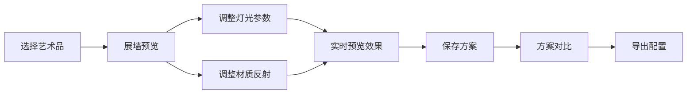

## 1. 产品概述

私人艺术品光照预览 Web 应用，为艺术收藏家、策展人和画廊从业者提供虚拟展墙光照效果预览工具。用户可以上传或选择艺术品，调整灯光参数和材质反射效果，实时预览展墙效果，并支持多方案对比与本地保存。

- 核心价值：降低实体布光成本，提升策展效率，实现光照效果的数字化预览
- 目标用户：私人收藏家、画廊策展人、室内设计师

## 2. 核心功能

### 2.1 功能模块

1. **作品列表**：管理和选择艺术品，支持添加、删除、查看详情
2. **展墙预览**：实时渲染展墙场景，展示艺术品在不同光照下的效果
3. **灯光参数**：调节光源类型、色温、亮度、角度、位置等参数
4. **材质反射**：调整画框材质、墙面材质、反光度、粗糙度等属性
5. **方案对比**：同时对比多种光照方案，选择最佳效果
6. **本地保存**：将配置方案保存到本地存储，支持导入导出

### 2.2 页面详情

| 页面名称 | 模块名称 | 功能描述 |
|---------|---------|---------|
| 主应用 | 作品列表 | 网格展示艺术品缩略图，支持搜索、筛选、添加新作品 |
| 主应用 | 展墙预览 | 3D/2D 渲染展墙场景，实时响应参数变化 |
| 主应用 | 灯光参数 | 滑杆控制色温、亮度，选择光源类型，调整灯光位置 |
| 主应用 | 材质反射 | 材质预设选择，反光度、粗糙度参数调节 |
| 主应用 | 方案对比 | 多栏布局展示不同方案，支持添加/移除对比项 |
| 主应用 | 本地保存 | 方案列表管理，导入导出 JSON 配置文件 |

## 3. 核心流程

用户选择艺术品 → 进入展墙预览 → 调整灯光参数 → 调整材质反射 → 保存当前方案 → 添加到对比列表 → 多方案对比 → 导出最佳方案

## 4. 用户界面设计

### 4.1 设计风格
- **主色调**：深炭灰 (#1a1a1a) 背景，搭配金色 (#d4af37) 点缀，营造美术馆高端氛围
- **辅助色**：暖光橙 (#ff9500)、冷光蓝 (#00a8ff) 表示不同色温
- **按钮风格**：极简圆角按钮，悬停有微妙光晕效果
- **字体**：标题使用 Playfair Display（优雅衬线），正文使用 Inter（现代无衬线）
- **布局风格**：三栏布局，左侧作品列表，中间预览区，右侧参数控制面板
- **图标风格**：线性简约图标，统一 24px 尺寸

### 4.2 页面设计概述

| 页面名称 | 模块名称 | UI 元素 |
|---------|---------|---------|
| 主应用 | 作品列表 | 卡片式网格，悬停放大效果，选中金色边框 |
| 主应用 | 展墙预览 | 渐变墙面，投影效果，实时光照变化动画 |
| 主应用 | 灯光参数 | 自定义滑杆组件，实时数值显示，色温渐变条 |
| 主应用 | 材质反射 | 材质预设卡片，材质属性滑杆组 |
| 主应用 | 方案对比 | 可拖拽分割面板，同步缩放对比 |
| 主应用 | 本地保存 | 方案缩略图列表，导入导出按钮 |

### 4.3 响应式
- Desktop-first 设计，主内容区最小宽度 1200px
- 平板端：左右面板可折叠收起
- 移动端：垂直堆叠布局，标签页切换各模块

### 4.4 场景渲染指导
- **环境氛围**：美术馆暗房环境，墙面深灰色，地板有轻微反光
- **灯光设置**：主光源模拟轨道射灯，支持聚光和漫射两种模式
- **构图**：艺术品居中展示，上下留出适当留白
- **交互**：参数调节时预览区有平滑过渡动画（300ms ease-out）
- **后处理**：轻微 Bloom 效果模拟光晕，ACES 色调映射
