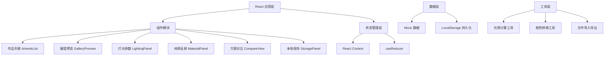

## 1. 架构设计



## 2. 技术描述

- **前端框架**：React@18 + TypeScript@5
- **构建工具**：Vite@5
- **样式方案**：TailwindCSS@3 + CSS Variables
- **状态管理**：React Context + useReducer
- **UI 增强**：Framer Motion（动画）、Lucide React（图标）
- **后端**：无（纯前端应用）
- **数据存储**：LocalStorage + Mock 数据

## 3. 目录结构

```
src/
├── components/
│   ├── ArtworkList/
│   ├── GalleryPreview/
│   ├── LightingPanel/
│   ├── MaterialPanel/
│   ├── CompareView/
│   ├── StoragePanel/
│   └── ui/
├── context/
│   └── AppContext.tsx
├── types/
│   └── index.ts
├── data/
│   └── mockData.ts
├── utils/
│   ├── lighting.ts
│   ├── color.ts
│   └── storage.ts
├── hooks/
│   └── useLocalStorage.ts
├── App.tsx
├── main.tsx
└── index.css
```

## 4. 类型定义

### 4.1 核心数据类型

```typescript
interface Artwork {
  id: string;
  title: string;
  artist: string;
  year: number;
  imageUrl: string;
  width: number;
  height: number;
  medium: string;
}

interface LightingConfig {
  type: 'spotlight' | 'floodlight' | 'ambient';
  colorTemperature: number;
  intensity: number;
  angle: number;
  positionX: number;
  positionY: number;
  positionZ: number;
}

interface MaterialConfig {
  frameMaterial: 'wood' | 'metal' | 'gold' | 'silver' | 'none';
  wallMaterial: 'matte' | 'satin' | 'glossy' | 'concrete';
  reflectivity: number;
  roughness: number;
}

interface Preset {
  id: string;
  name: string;
  artworkId: string;
  lighting: LightingConfig;
  material: MaterialConfig;
  createdAt: number;
  thumbnail: string;
}
```

## 5. 数据模型

### 5.1 Mock 数据结构

```typescript
// 艺术品数据
const mockArtworks: Artwork[] = [
  {
    id: '1',
    title: '星月夜',
    artist: '文森特·梵高',
    year: 1889,
    imageUrl: '...',
    width: 73.7,
    height: 92.1,
    medium: '布面油画'
  },
  // ... 更多作品
];

// 默认光照配置
const defaultLighting: LightingConfig = {
  type: 'spotlight',
  colorTemperature: 3500,
  intensity: 0.8,
  angle: 45,
  positionX: 0,
  positionY: 2,
  positionZ: 3
};

// 默认材质配置
const defaultMaterial: MaterialConfig = {
  frameMaterial: 'gold',
  wallMaterial: 'matte',
  reflectivity: 0.3,
  roughness: 0.7
};
```

### 5.2 LocalStorage 键名

- `artwork_preview_presets`: 保存的方案列表
- `artwork_preview_last_artwork`: 最后选择的艺术品
- `artwork_preview_last_lighting`: 最后使用的光照配置
- `artwork_preview_last_material`: 最后使用的材质配置
